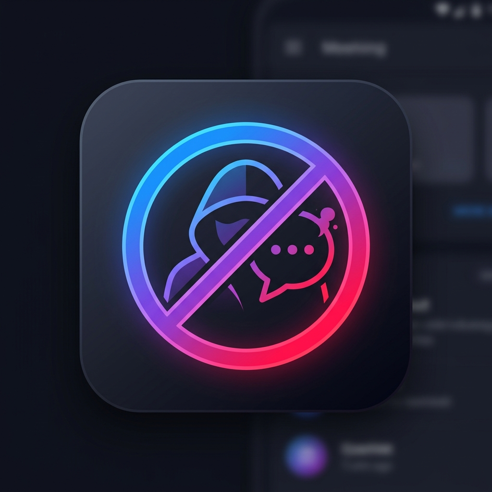

  
  <h1>Unsent Messenger</h1>
  
<strong>The Anti-Unsend Countermeasure for Android</strong>

  

    
    
    
  

---

An Android counter-tool built with **Kotlin**, **Jetpack Compose (Material 3)**, and **Room Database** that captures and logs incoming Messenger notifications locally on your device, allowing you to view messages and photos even after the sender has clicked **"Unsend for everyone"**.

---

## 📲 Instant Download & Install (No PC Required!)

You can download the latest compiled `.apk` directly to your Android phone from GitHub:

👉 **[Download Latest APK from GitHub Releases](https://github.com/Ambatucode/unsent-messenger/releases/tag/latest)**

*Every time new code is pushed to this repository, GitHub Actions automatically compiles and updates the `.apk`.*

---

## ✨ Features

- ⚡ **Real-time Capture**: Intercepts notifications from Facebook Messenger (`com.facebook.orca`), Messenger Lite, Instagram Direct, and WhatsApp.
- 🚫 **Unsent Message & Photo Detection**: Automatically detects and highlights messages and images retracted by the sender.
- 🖼️ **In-App Photo Viewer**: Full-screen zoomable photo viewer for saved images.
- 📱 **Cross-Platform Sender Support**: Works when the sender is using **iOS (iPhone/iPad)**, Android, Mac, or Windows Web.
- 🔒 **100% Private & On-Device**: All chat logs and images are stored locally in an offline SQLite/Room database. No servers, no tracking, 0 cloud uploads.
- 🔋 **Reboot & Battery Resilient**: Auto-rebinds upon device reboot (`BOOT_COMPLETED`) with battery optimization exemption support.
- 🧪 **Built-in Diagnostic Tool**: Simulate test unsent messages and photos from Settings without needing a second phone.

---

## 🛠️ Tech Stack & Architecture

- **Language**: Kotlin 2.1
- **UI Framework**: Jetpack Compose (Material 3)
- **Database**: AndroidX Room (SQLite) with KSP
- **Async & Reactive**: Kotlin Coroutines & `Flow`
- **Core Service**: Android `NotificationListenerService` (`android.permission.BIND_NOTIFICATION_LISTENER_SERVICE`)
- **CI/CD Pipeline**: GitHub Actions (`assembleDebug` on push)
- **Navigation**: Navigation Compose

---

## ⚙️ First-Time Phone Setup

When you open the app on your phone:
1. **Grant Notification Access**:
   - Tap **Enable Notification Access** -> Toggle **ON** for `Unsent Messenger`.
2. **Disable Battery Optimization**:
   - Tap **Ignore Battery Optimization** so Android won't shut down the service in the background.

---

## 🧪 Testing It Out

### Method 1: Using the Built-in Simulator
1. Open the app -> Tap the **Settings (⚙️)** icon in the top right.
2. Tap **"Simulate Test Messenger Unsend"**.
3. Go back to the main chat list -> You will see a test conversation showing a normal message, an unsent photo, and an unsent text highlighted in red!

### Method 2: Real Messenger Test
1. Have a friend (or another account on iPhone or Android) send you a text or photo on Messenger while your phone is on the home screen or locked.
2. Have them unsend it ("Unsend for everyone").
3. Open **Unsent Messenger** -> The deleted text and photo will be preserved in your chat history!
